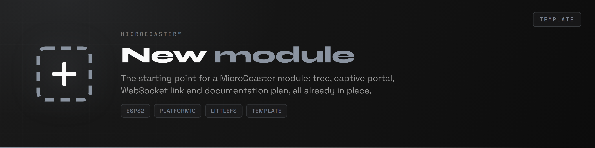
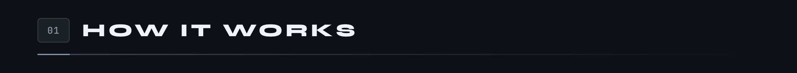
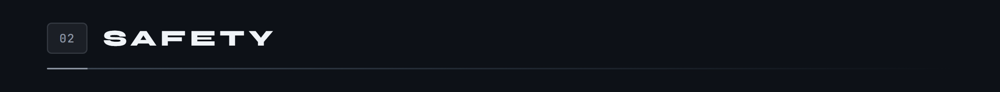
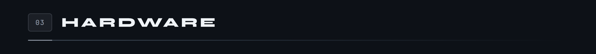
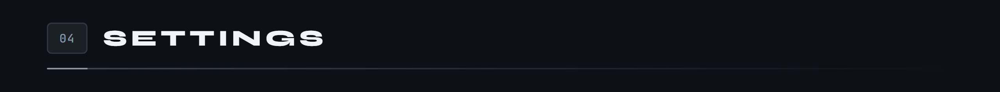
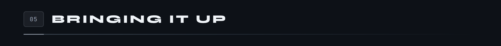
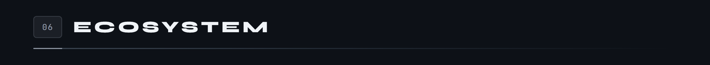

<div align="center">

<p>
  <a href="README.md"></a>
  
</p>



</div>

[One sentence that says what the module actually does. Not "a module for managing X", but what moves, what lights up, what gets measured.]

[A paragraph on the principle: which mechanical part is driven, by which component, and what triggers the action.]

Like the other modules, it is configured on first boot through a captive portal, then joins the server over WebSocket.

**Version [0.1.0]**



[Explain the logic, not the list of functions. If the module has a state machine, show it.]

```
STATE_A      what is true in this state
STATE_B      what causes the move here
STATE_FAULT  what brought it about
```



[What happens if the link drops, if a sensor lies, if an order is lost. What the safe state is, and why it is that one.]

[Which local bounds protect the hardware: maximum duration, current threshold, watchdog timeout.]



[A pinout diagram, not a table: the board in the middle, its pins laid out on either side, outputs on one side and inputs on the other. The alt text has to list every pin and its role, since an image cannot be found with Ctrl+F.]

`docs/schemas/brochage.png`

[Under the diagram, a sentence on what the pinout does not say: why that component, which wiring trap, what breaks if two lines are swapped.]



[A grid of cards, one per parameter. The name in monospace, then what changes when you raise or lower it. Not the default value: that lives in the code, where it will go stale more slowly.]

`docs/schemas/reglages.png`



Requires [PlatformIO](https://platformio.org/) inside Visual Studio Code.

```bash
pio run                  # build
pio run -t upload        # upload the firmware
pio run -t uploadfs      # upload the portal to LittleFS
pio device monitor       # serial console, 115200 baud
```

1. Power the module. It creates a WiFi access point.
2. Connect to it and open `http://192.168.4.1`.
3. Enter the target network.
4. The module reboots, joins the network and announces itself to the server.

The WiFi credentials stay in the module's memory, never in the repository.



[What works, what is still to be written. Be straight about it: a repository that promises more than it delivers ends up turning on its author.]

The common base for every module is the [WiFi Manager](https://github.com/Microcoaster/MicroCoaster_WifiManager/blob/main/README.en.md), and the driving is done from the [WebApp](https://github.com/Microcoaster/MicroCoasterWebApp/blob/main/README.en.md).

---

### On the images

The banners in `docs/sections/` ship in neutral grey. For a new module, regenerate them in the accent colour chosen for its banner, so the repository stays coherent from top to bottom. The six titles shipped cover the standard plan; drop the ones you do not need rather than inventing empty sections.

`docs/schemas/` is where the figures go: state machine, pinout, settings, commands. The rule followed in the other modules is simple. Anything with an order becomes a sequence of cards linked by arrows. Anything without one becomes a grid. A pinout becomes a board diagram. No Markdown table survives anywhere.

Every figure carries alt text that lists its contents. That is what makes the page readable to a screen reader, and findable by an in-page search, which an image does not allow.

---

<sub>MicroCoaster · Author: [AUTHOR]</sub>
