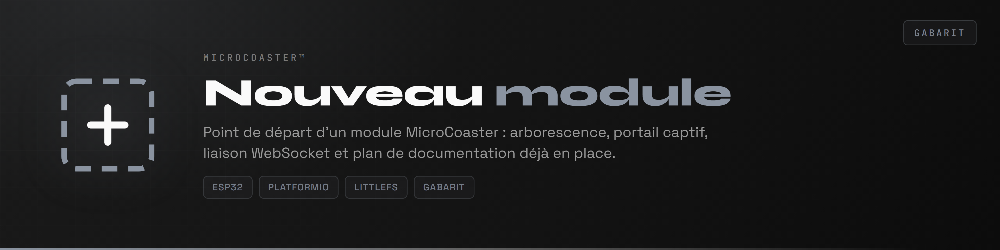
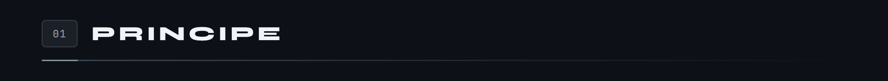
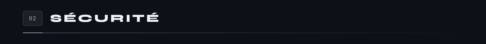
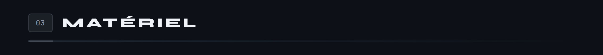
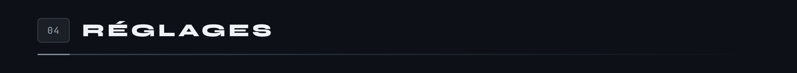
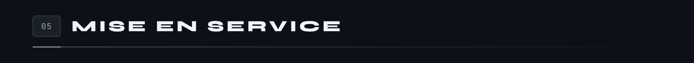
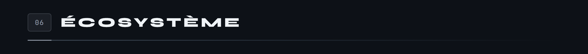

<div align="center">

<p>
  
  <a href="README.en.md"></a>
</p>



</div>

[Une phrase qui dit ce que fait le module, concrètement. Pas « module de gestion de X », mais ce qui bouge, ce qui s'allume, ce qui est mesuré.]

[Un paragraphe sur le principe : quelle pièce mécanique est pilotée, par quel composant, et ce qui déclenche l'action.]

Comme les autres modules, il se configure au premier démarrage par portail captif, puis rejoint le serveur en WebSocket.

**Version [0.1.0]**



[Expliquer la logique, pas la liste des fonctions. Si le module a une machine à états, la montrer.]

```
ETAT_A       ce qui est vrai dans cet état
ETAT_B       ce qui déclenche le passage ici
ETAT_FAULT   ce qui l'a provoqué
```



[Ce qui arrive si la liaison tombe, si un capteur ment, si un ordre se perd. Quel est l'état sûr, et pourquoi c'est celui-là.]

[Quelles bornes locales protègent le matériel : durée maximale, seuil de courant, délai de garde.]



[Un schéma de brochage, pas un tableau : la carte au centre, ses broches réparties de part et d'autre, les sorties d'un côté et les entrées de l'autre. Le texte alternatif doit énumérer chaque broche et son rôle, puisque l'image ne se cherche pas au Ctrl+F.]

`docs/schemas/brochage.png`

[Sous le schéma, une phrase sur ce que le brochage ne dit pas : pourquoi ce composant, quel piège de câblage, ce qui casse si on intervertit deux lignes.]



[Une grille de cartes, une par paramètre. Le nom en monospace, puis ce que ça change quand on l'augmente ou le diminue. Pas la valeur par défaut : elle est dans le code et s'y périmera moins vite.]

`docs/schemas/reglages.png`



Nécessite [PlatformIO](https://platformio.org/) dans Visual Studio Code.

```bash
pio run                  # compilation
pio run -t upload        # téléversement du firmware
pio run -t uploadfs      # téléversement du portail vers LittleFS
pio device monitor       # console série, 115200 bauds
```

1. Alimenter le module. Il crée un point d'accès WiFi.
2. S'y connecter et ouvrir `http://192.168.4.1`.
3. Renseigner le réseau de destination.
4. Le module redémarre, rejoint le réseau et s'annonce auprès du serveur.

Les identifiants WiFi restent en mémoire du module, jamais dans le dépôt.



[Ce qui marche, ce qui reste à écrire. Être franc : un dépôt qui annonce plus qu'il ne fait finit par se retourner contre son auteur.]

Le socle commun à tous les modules est le [WiFi Manager](https://github.com/Microcoaster/MicroCoaster_WifiManager), et le pilotage se fait depuis la [WebApp](https://github.com/Microcoaster/MicroCoasterWebApp).

---

### Sur les images

Les bandeaux de `docs/sections/` sont fournis en gris neutre. Pour un nouveau module, regénérez-les à la couleur d'accent choisie pour sa bannière, afin que le dépôt reste cohérent de haut en bas. Les six titres livrés couvrent le plan type ; retirez ceux qui ne servent pas plutôt que d'inventer des sections vides.

`docs/schemas/` accueille les figures : machine à états, brochage, réglages, commandes. La règle suivie dans les autres modules est simple. Ce qui a un ordre devient une séquence de cartes reliées par des flèches. Ce qui n'en a pas devient une grille. Un brochage devient un schéma de carte. Un tableau Markdown ne subsiste nulle part.

Chaque figure porte un texte alternatif qui énumère son contenu. C'est ce qui rend la page lisible à un lecteur d'écran, et retrouvable par une recherche dans la page, ce qu'une image ne permet pas.

---

<sub>MicroCoaster · Auteur : [AUTEUR]</sub>
